# Hi, I'm Furkan 👋

### Building things with software, electronics, radio and real-world systems

  
  
  

  
  
  
  
  
  
  
  
  
  

---

## About me

I enjoy building systems where **software, hardware, networking and communication** come together.

My interests usually revolve around practical, field-oriented projects: communication platforms, embedded devices, custom PCBs, mesh networks, self-hosted infrastructure and tools that connect digital systems to the real world.

I like understanding how things work, improving them, and turning rough ideas into usable systems.

## What I work on

- **Embedded systems** with ESP32, LoRa and sensors
- **Communication platforms** using VoIP and Asterisk
- **Mesh and resilient networks** such as Meshtastic, AREDN and Reticulum
- **Custom electronics and PCB design**
- **Linux, Docker and self-hosted infrastructure**
- **Web dashboards and backend tools** for managing real-world systems

## 📻 Amateur Radio

**Callsign:** `TA1XF`

Amateur radio brings together many of the areas I enjoy most: RF, networking, electronics, software and emergency communications.

### Areas I enjoy exploring

- LoRa and mesh communication
- AREDN and resilient networking
- Reticulum-based communication systems
- Repeaters and RF infrastructure
- Emergency and off-grid communication
- Custom radio-related hardware

## 🧰 Tech stack

### Software

### Infrastructure

### Hardware

### Radio / Networking

## 🔭 Current focus

- Building communication systems that combine software and RF
- Designing compact custom hardware projects
- Experimenting with mesh and resilient networking
- Developing dashboards and control interfaces for infrastructure
- Using open-source tools and self-hosted systems wherever practical

## ⚡ A principle I like

> Build systems that remain useful even when conditions are not ideal.

## 📊 GitHub stats

The cards above are generated by GitHub Actions and stored in this repository, so the profile does not depend on the public Vercel stats endpoint.

---

Still learning, experimenting and building.
